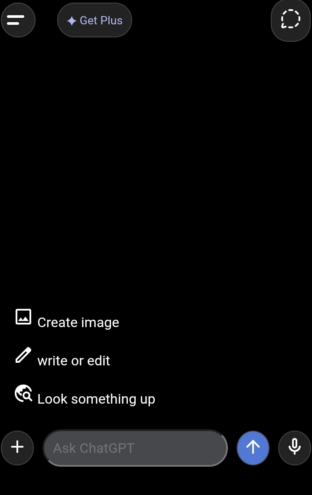

# ChatGPT-clone-

🤖 ChatGPT Clone

A simple ChatGPT-inspired web project built using HTML, CSS, and JavaScript.

✨ Features

- Chat interface
- User and AI message bubbles
- Predefined AI responses
- Responsive design
- Beginner-friendly code

🛠️ Technologies Used

- 
- CSS3
- JavaScript

📷 Screenshot



🚀 Live Demo

https://spck.io/labs/nXHNWcdR6

🙏 Acknowledgements

This project was built by me as a learning project. I also used ChatGPT for guidance, explanations, debugging, and improving parts of the code while developing it.

### 📁 Project Structure

```text
ChatGPT-clone/
├── .gitignore
├── IMG_20260806_174021.jpg
├── LICENSE
├── README.md
├── index.html
└── script.js
```


👨‍💻 Author

Created by Kartik Kushwaha.
